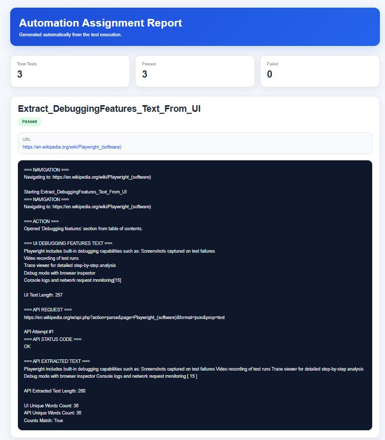
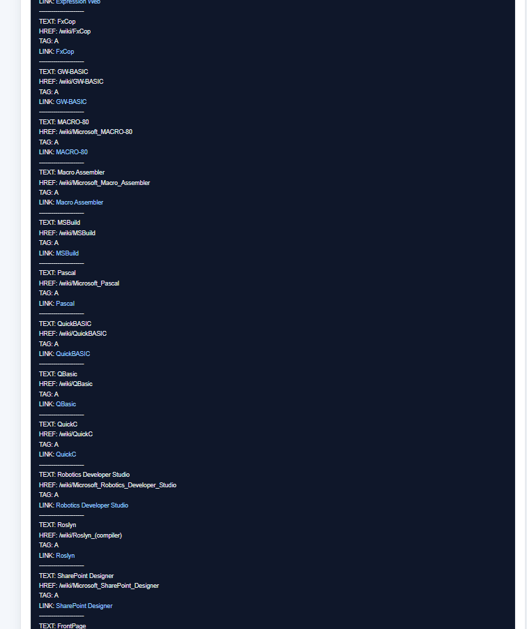
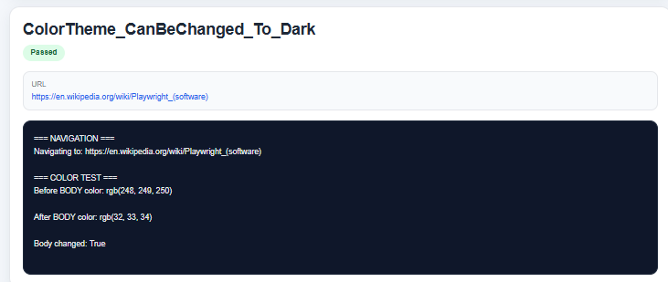

# Automation Assignment – UI & API Testing

## 📌 Overview

QA automation project built with **C# + Playwright (.NET)**.
Validates data consistency between UI and API, along with UI behavior checks.

---

## 🧪 Tasks

### ✅ Task 1 – UI vs API Validation

* Extract "Debugging features" via UI & API
* Normalize text and count unique words
* Compare results

### ✅ Task 2 – Links Validation

* Validate all technology names are clickable links

### ✅ Task 3 – Dark Mode Validation

* Switch to Dark mode
* Verify background color change

---

## 📊 Report

Test report:

```
TestResults/latest-report.html
```

---

## 🖼 Screenshots

### Task 1 – UI & API Validation


### Task 2 – Links Validation


### Task 3 – Dark Mode


## 🚀 Run

```bash
dotnet test
```

---

## 💡 Highlights

* UI + API validation in a single flow
* Clean and simple architecture
* Custom HTML reporting
